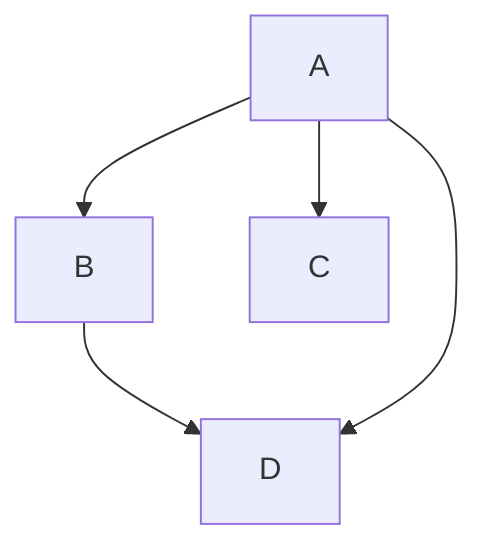
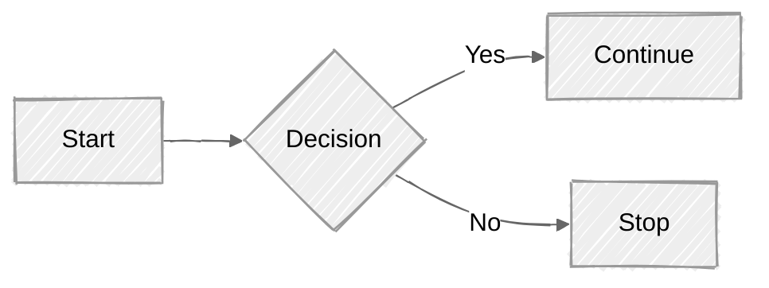
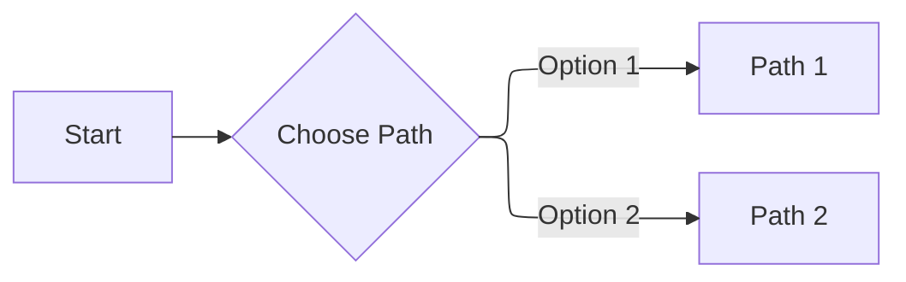

# DevOps Books

> [Mermaid Diagram Documentation](https://mermaid.ai/open-source/intro/getting-started.html)

```mermaid
graph TD;
    A-->B;
    A-->C;
    B-->D;
    A-->D;
```

```mermaid
  info
```

```mermaid
---
config:
  look: handDrawn
  theme: neutral
---
flowchart LR
  A[Start] --> B{Decision}
  B -->|Yes| C[Continue]
  B -->|No| D[Stop]
```

```mermaid
---
config:
  layout: elk
  elk:
    mergeEdges: true
    nodePlacementStrategy: LINEAR_SEGMENTS
    nodePlacementAlignment: NONE
---
flowchart LR
  A[Start] --> B{Choose Path}
  B -->|Option 1| C[Path 1]
  B -->|Option 2| D[Path 2]
```